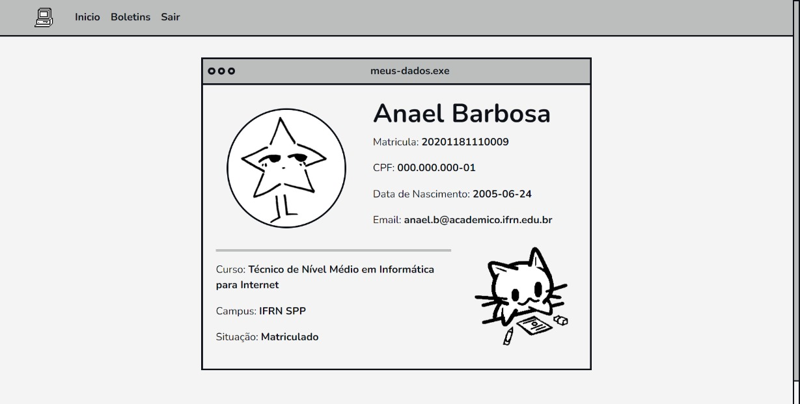
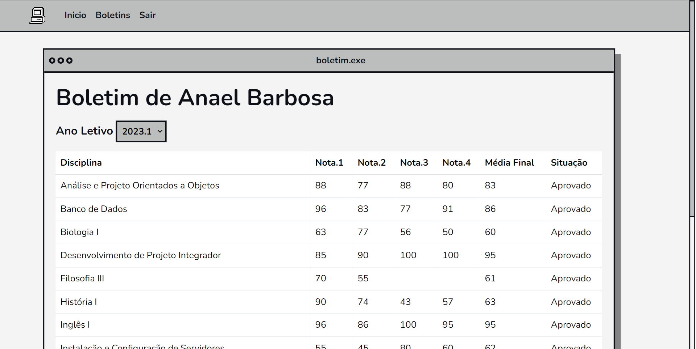

# Projeto Final da Segunda Unidade de POS

## Sobre

Esse sistema web faz autenticação OAuth com o SUAP (Sistema Unificado de Administração Pública) para exibir ao usuário aluno seus dados e boletins dos seus períodos letivos.

Nesse projeto foram utilizados Python, Flask, HTML, CSS, Javascript, jQuery e Bootstrap. 

Projeto prático de disciplina aplicado pelo professor [Diego Cirilo](https://github.com/dvcirilo).

---

## Grupo

<table>
  <tr>
    <td align="center">
      <a href="https://github.com/dvanael" title="Anael Barbosa">
        <br>
        <sub>
          <b>Anael Barbosa 🎸</b>
        </sub>
      </a>
    </td>
    <td align="center">
      <a href="https://github.com/Thaynix" title="Thaisy Gonçalves">
        <br>
        <sub>
          <b>Thaisy  Gonçalves 🎀</b>
        </sub>
      </a>
    </td>
  </tr>
</table>

---

## Apresentação

**Página do Usuário**



---

**Página de Boletins**




## Instalação

Siga os seguintes passos para rodar o projeto localmente.

- Crie um ambiente virtual

```bash
python -m venv .venv
```

- Ative o ambiente virtual

*powershell*
```powershell
.venv/Scripts/activate
```

- Instale as dependências do projeto

```bash
pip install -r requirements.txt
```

- Crie um arquivo `.env` e adicione as informações da API do SUAP

```
SECRET_KEY='development'
CLIENT_ID= <seu client id>
CLIENT_SECRET= <seu client secret>
```

- Rode o servidor

```bash
flask run
```

---
